# Taller 3

### Tableros en Dash

##### Analítica Computacional para la Toma de Decisiones

---

|     Nombres      |      Apellidos       |     Login     |  Codigo   |
| :--------------: | :------------------: | :-----------: | :-------: |
|     Santiago     | Gonzalez Montealegre | s.gonzalez35  | 202012274 |
| Juliana Carolina |  Cardenas Barragan   | jc.cardenasb1 | 202011683 |

---

---

## Un primer tablero en Dash

---

### 2.

¿Cómo se crea el objeto `app` en _Dash_?

   <br>

**R/**

Importamos la librería _Dash_ y posteriormente creamos un nuevo objeto de tipo Dash que pertenece a dicha librería. Dentro de los parámetros necesarios se encuentra `name=__name__` que es el valor que hace fácil para Dash encontrar ciertos elementos estáticos necesarios. ([Info](https://www.angela1c.com/projects/dash/plotly_intro/))

```py
import dash

app = dash.Dash(name=__name__)

# Agregar parametros como hojas de estilo
app = dash.Dash(name=__name__, external_stylesheets=['url'])
```

---

### 3.

Describa el conjunto de datos del Dataframe

<br>

**R/**

```py
df = pd.DataFrame(
  {
    "Fiebre": ["Moderada", "Leve", "Alta", "Moderada", "Leve", "Alta"],
    "Casos": [4, 1, 2, 2, 4, 5],
    "Diagnóstico": ["Positivo", "Positivo", "Positivo", "Negativo", "Negativo", "Negativo"]
  }
)
```

|  Fiebre  | Casos | Diagnóstico |
| :------: | :---: | :---------: |
| Moderada |   4   |  Positivo   |
|   Leve   |   1   |  Positivo   |
|   Alta   |   2   |  Positivo   |
| Moderada |   2   |  Negativo   |
|   Leve   |   4   |  Negativo   |
|   Alta   |   5   |  Negativo   |

Los datos corresponden a un registro con tres columnas, Fiebre, Casos y Diagnóstico. Estos datos muestran el número de casos Positivos o Negativos según los síntomas de fiebre presentados por los pacientes.

---

### 5.

Ejecute la aplicación e incluya un pantallazo del código en ejecución y la aplicación siendo ejecutada en el navegador

<br>

**R/**
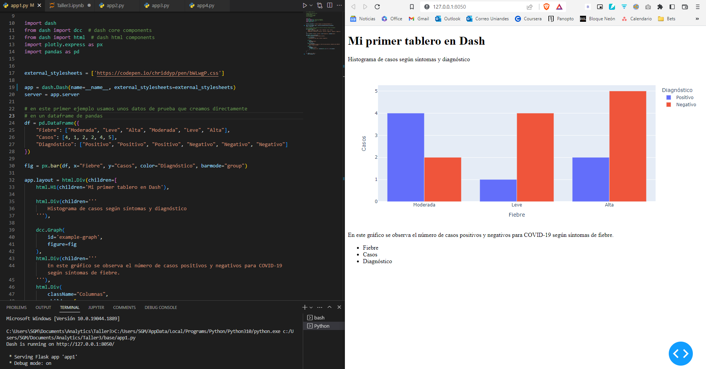

---

### 6.

Considerando la aplicación describa qué hace el comando

```py
fig = px.bar(
  data_frame=df,
  x="Fiebre",
  y="Casos",
  color="Diagnóstico",
  barmode="group"
)
```

<br>

**R/**

Se crea en una variable un objeto que posteriormente será agregado a la aplicación. Este objeto es creado con la librería `plotly.express` y es un objeto para crear un gráfico de barras.

**Parámetros**

- `data_frame`: Recibe valores de tipo pandas DataFrame donde están registrados los datos que se van a graficar.
- `x`: El nombre de la columna del DataFrame recibido en `data_frame` cuyos valores serán usados para colocar marcas a lo largo del eje x del gráfico.
- `y`: El nombre de la columna del DataFrame recibido en `data_frame` cuyos valores serán usados para colocar marcas a lo largo del eje y del gráfico.
- `color`: El nombre de la columna del DataFrame recibido en `data_frame` cuyos valores serán usados para asignar colores a las marcas. Generalmente se usa para variables categóricas que distingan los datos.
- `barmode`: Un `str` que puede recibir los valores `'relative'`, `'overlay'`, `'group'`.
  - `'relative'`: las barras para las categorías son apiladas o _stacked_ una encima de la otra.
    
  - `'overlay'`: las barras son dibujadas una encima de la otra, se solapan.
    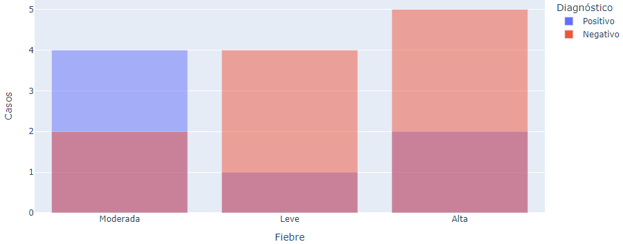
  - `'group'`: las barras son dibujadas al lado de la otra para distinguir las categorías.
    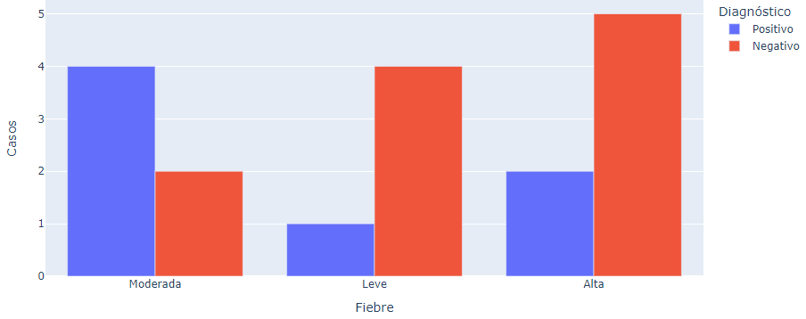

[Plotly Express](https://plotly.com/python-api-reference/generated/plotly.express.bar.html)
[Plotly Bar charts](https://plotly.com/python/bar-charts/)

---

### 7.

- Describa que hace el siguiente código

  ```py
  dcc.Graph(
     id='example-graph',
     figure=fig
  ),
  ```

   <br>

  **R/**

  Esto permite añadir a la aplicación la gráfica que creamos anteriormente.

  - `id`: este parámetro permite identificar de forma particular este elemento, en caso de que sea necesario añadirle estilo personalizado o ser referenciado por otro objeto del HTML.
  - `figure`: este parámetro permite agreagar la variable en la que se creó la figura o gráfico a mostrar.

  <br>

- Describa que hace el siguiente código

  ```py
  html.Div(
     className="Columnas",
     children=[
        html.Ul(id='my-list', children=[html.Li(i) for i in df.columns])
     ],
  )
  ```

  <br>

  **R/**

  Esto permite añadir una lista desordenada `Ul` la cual tiene como subcontenido los nombres de las columnas del DataFrame creados como elementos de la lista `Li`. Toda esta lista se encuentra dentro de un contenedor `Div` que permite agrupar los elementos html.

  - `children`: en este parámetro se ubican todos los subelementos del objeto siendo creado

  Un gráfico que representa este código se meustra a continuación

  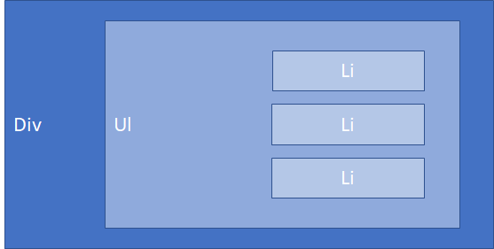

---

### 8.

Realice cambios en los datos para obtener una nueva versión del tablero con datos de su elección.

<br>

**R/**

Los nuevos datos a utilizar son:

```py
df = pd.DataFrame(
    {
        "Votos": [5, 9, 4, 9, 2, 3, 4, 9, 5],
        "Candidato": ["Federico Gutierrez", "Gustavo Petro", "Rodolfo Hernández", "Federico Gutierrez", "Gustavo Petro", "Rodolfo Hernández", "Federico Gutierrez", "Gustavo Petro", "Rodolfo Hernández"],
        "Departamento": ["Cundinamarca", "Cundinamarca", "Cundinamarca", "Meta", "Meta", "Meta", "Guaviare", "Guaviare", "Guaviare"],
    }
)
```

| Votos |     Candidato      | Departamento |
| :---: | :----------------: | :----------: |
|   5   | Federico Gutierrez | Cundinamarca |
|   9   |   Gustavo Petro    | Cundinamarca |
|   4   | Rodolfo Hernández  | Cundinamarca |
|   9   | Federico Gutierrez |     Meta     |
|   2   |   Gustavo Petro    |     Meta     |
|   3   | Rodolfo Hernández  |     Meta     |
|   4   | Federico Gutierrez |   Guaviare   |
|   9   |   Gustavo Petro    |   Guaviare   |
|   5   | Rodolfo Hernández  |   Guaviare   |

Y la aplicación con los nuevos datos en el archivo `app1_mod.py` se ve de la siguiente forma:

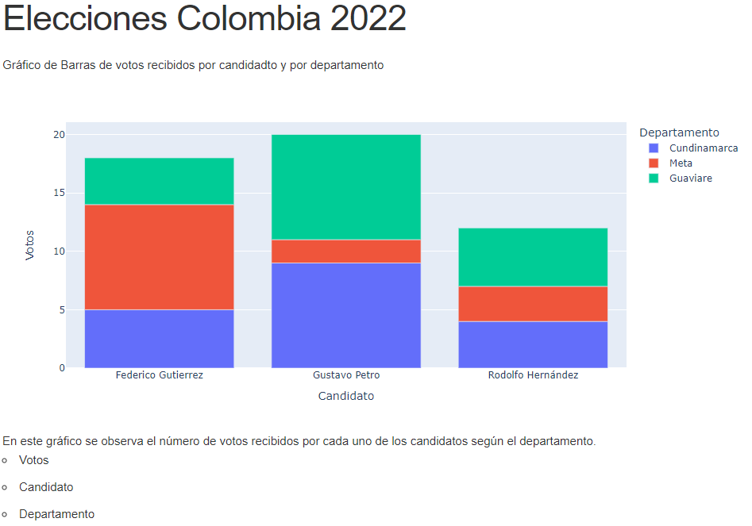

---

---

## Callbacks

---

### 3.

Describa el layout de la aplicación del archivo `app2.py`

<br>

**R/**

El layout es un elemento Div contenedor que posee a cuatro subelementos

- _H6_: Este elemento permite colocar un encabezado de nivel 6 (Existen 6 niveles de encabezados, siendo 1 el más grande o importante)

- _Div_: Este es otro elemento contenedor con dos subelementos:

  - _Texto_: No ha una etiqueta particular, sino que solo se escribe el texto que se desea mostrar. En este caso `Input: `
  - _Input_: Un elemento que permite al usuario introducir un texto particular en la app. Es importante definir un id para que el valor introducido por el usuario pueda ser usado por otros elementos.
    ```py
    # https://dash.plotly.com/basic-callbacks
    dcc.Input(
      id='my-input', # el id para identificar por otros elementos el objeto
      value='valor inicial', # el valor inicial a mostrar en el input
      type='text' # el tipo de input, puede ser
      # "text", "number", "password", "email", "search", "tel", "url", "range", "hidden"
    )
    ```

- _Br_: Es un elemento HTML que permite insertar saltos de línea
- _Div_: El último elemento es otro div el cual no tiene subelementos ni texto inicial, sin embargo, se le asigna un id para poder ser modificado proximamente por otro elemento.

El layout se puede ver de la siguiente forma elemento por elemento:
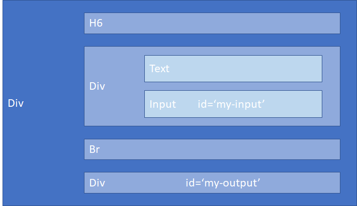

Ya ejecutada la aplicación se observa:

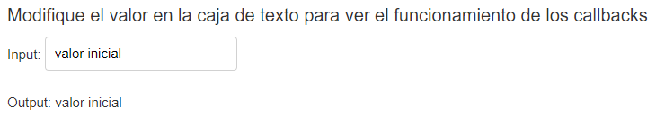

---

### 5.

Describa qué hace la función `update_output_div`

```py
@app.callback(
    [Output(component_id='my-output', component_property='children')],
    [Input(component_id='my-input', component_property='value')]
)
def update_output_div(input_value):
    return f'Output: {input_value}'
```

<br>

**R/**

Cada vez que una propiedad input cambie, la función que encierre el decorator `@app.callback` será llamada automáticamente, en este caso `update_output_div`. La función recibe como parámetro el nuevo valor de la propiedad input. Finalmente _Dash_ actualiza la propiedad del componente output con lo que haya retornado la función.
Apenas se ejecuta la aplicación se ejecuta la función como si hubiera un cambio en el input, por esta razón así el output esté vacío al configurar el layout cuando se ejecuta la aplicación se le asigna un valor al output.

---

### 6.

Describa qué hace el decorador `app.callback`

```py
@app.callback(
    Output(component_id='my-output', component_property='children'),
    [Input(component_id='my-input', component_property='value')]
)
```

<br>

**R/**

Con este decorador le estamos diciendo a _Dash_ que llame esta función cuando cambie el valor del input asociado por medio del `component_id='my-input'` (el Input en el Div para nuestra aplicación) y actualice el componente output asociado con el `component_id='my-output'` (el Div vacío en nuestra aplicación).

---

### 7.

Modifique la aplicación agregando texto personalizado.

<br>

**R/**

Se plantearon las siguientes modificaciones en el archvio `app2_mod.py`:

- Una página que permita registrar un usuario con un username y una password

- La aplicación inicial y el mensaje default:

  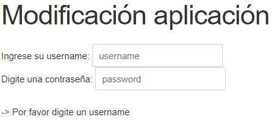

- El mensaje tras llenar solamente el username

  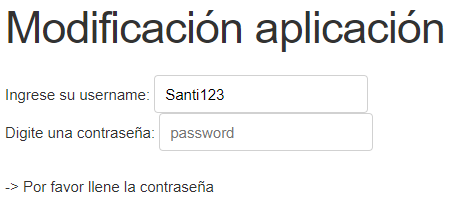

- El mensaje tras llenar ambos campos, username y password:

  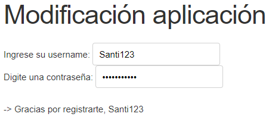

---

---

## Más visualizaciones e interacciones

---

### 4.

Describa el layout de `app3.py`

<br>

**R/**

El layout de la aplicación se compone de un div contenedor con únicamente dos subelementos:

- `Graph`: Este elemento es una gráfica que en principio esta vacía pero que tras lo inputs ya se llena.
- `Slider`: Este elemento es un slider que permite seleccionar un elemento de entre una lista de valores. En este caso la lista del Slider son los años que están presentes en el DataFrame, el mínimo valor es el año mínimo en el DataFrame, el máximo valor es el año máximo presente en el DataFrame y el slider inicia por default ubicado en el menor año.

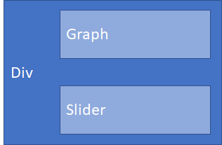

El layout una vez ejecutada la aplicación se ve de la siguiente forma

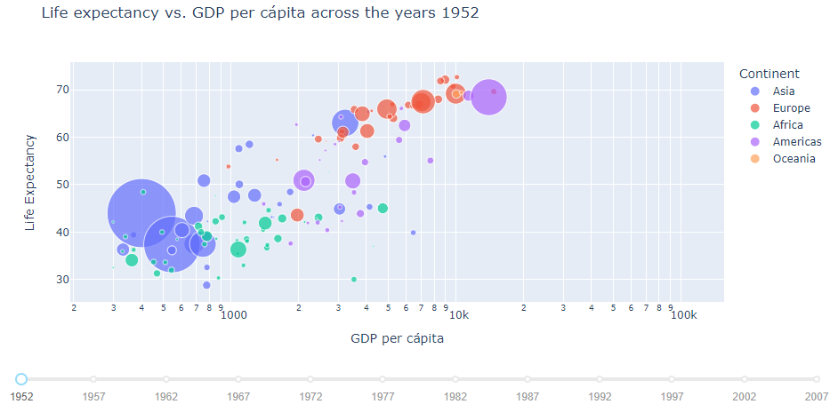

---

### 5.

Describa la función `update_figure`

```py
@app.callback(
    Output('graph-with-slider', 'figure'),
    [Input('year-slider', 'value')])
def update_figure(selected_year):
    filtered_df = df[df.year == selected_year]

    fig = px.scatter(filtered_df, x="gdpPercap", y="lifeExp",
                     size="pop", color="continent", hover_name="country",
                     log_x=True, size_max=55,
                     labels={
                         "pop": "Population",
                         "gdpPercap": "GDP per cápita",
                         "lifeExp": "Life Expectancy",
                         "continent": "Continent"
                     },
                     title=f"Life expectancy vs. GDP per cápita across the years {selected_year}")

    fig.update_layout(transition_duration=500)

    return fig
```

<br>

**R/**

La función recibe un parámetro con el año seleccionado en el Slider, posteriormente filtra el DataFrame para tener únicamente los valores de los países en ese año particular seleccionado en el Slider.

Una vez se filtró el DataFrame se procede a realizar un grafica de dispersión (_scatter_) con los datos filtrados donde:

- `x="gdpPercap"`: En el eje X se ubica el Producto Interno Bruto del país, que corresponde a la columna `gdpPercap` del DataFrame.
- `y="lifeExp"`: En el eje Y se grafica la Expectativa de Vida, que corresponde a la columna `lifeExp` del DataFrame.
- `size="pop"`: No todos los puntos son del mismo tamaño, sino que el tamaño es proporcional a la población del país en el año seleccionado, que corresponde a la columna `pop` del DataFrame.
- `color="continent"`: Cada uno de los puntos tiene un color diferente dependiendo del continente al que pertenece el país, que corresponde a la columna `continent` del DataFrame.
- `hover_name="country"`: Si se enfoca el mouse sobre uno de los puntos se mostrará la información de dicho punto, sin embargo, con este parámetro podemos destacar uno de los atributos, en este caso el nombre del país, que corresponde a la columna `country` del DataFrame.
- `log_x=True`: Convertimos los datos del eje X a escala logarítmica para facilitar la comparación.
- `size_max=55`: Es posible delimitar el tamaño máximo que pueden tener los puntos del diagrama de dispersión, en este caso el país de mayor población tendrá el punto más grande.
- `labels={}`: Podemos cambiar el nombre con el que se muestran las columnas del DataFrame.
- `title=""`: Agregamos un título al gráfico.

---

### 6.

Describa qué hace el decorador asociado a la función

```py
@app.callback(
    Output('graph-with-slider', 'figure'),
    [Input('year-slider', 'value')])
def update_figure(selected_year):

    return fig
```

Con este decorador le estamos diciendo a _Dash_ que llame esta función cuando cambie el valor en la lista del segundo parametro, los inputs. Aunque es una lista, en este caso solo hay un input asociado, el cual hace referencia al objeto html con id `year_slider` y se llama al valor de ese objeto para ser enviado como parámetro a la función asociada al decorador. Por otro lado, el primer parámetro (Output) es un objeto al cual le asociamos el id del objeto html que se modificará, el valor que retorne la función asociada al decorador será lo que tendrá el Output asociado.

---

### 10.

Realice una nueva visualización de interés.

<br>

**R/**

La nueva visualización grafica la media de la Expectativa de Vida de cada continente contra el año de medida.

Para esto es necesario crear un nuevo DataFrame a partir del original donde se pueda agregar la información de los países a solo continentes.

La aplicación se ve así:

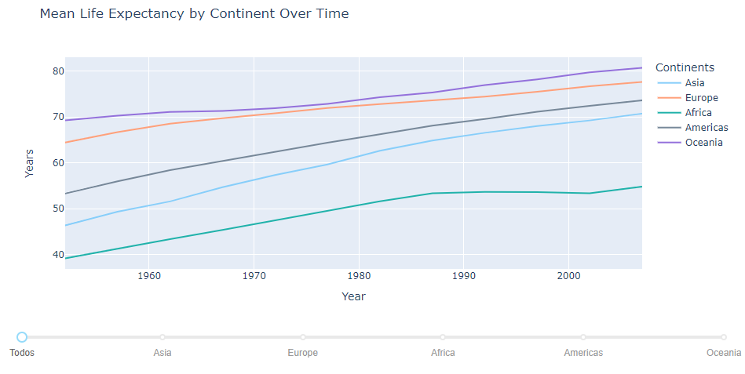

Además, se agrego un slider para poder visualizar individualmente cada continente, donde se muestra la Expectativa de Vida media para ese continente junto con un rango a partir de la desviación estándar en la expectativa de vida de los países del continente. Para mayor claridad se muestra a continuación:

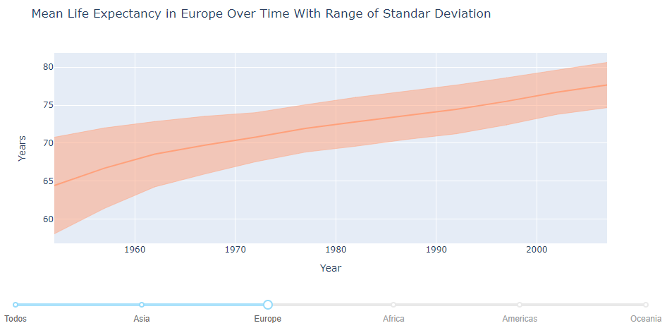

La línea de en medio un poco más gruesa y oscura representa la Expectativa de Vida media. Los rangos que se observan representan la desviación estándar de la media.
