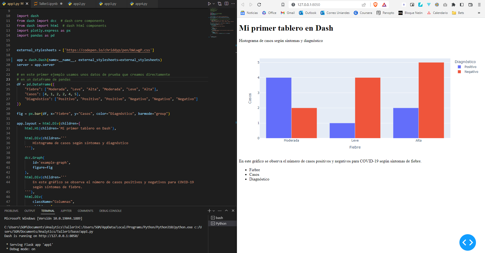
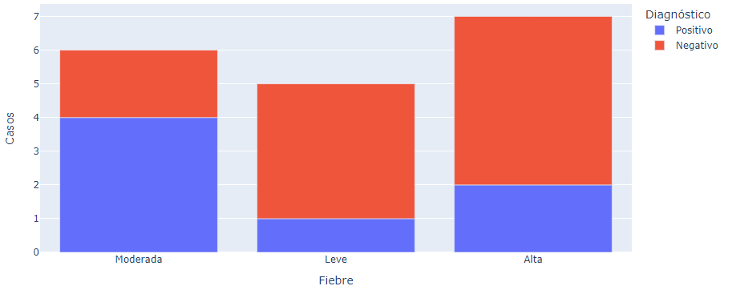
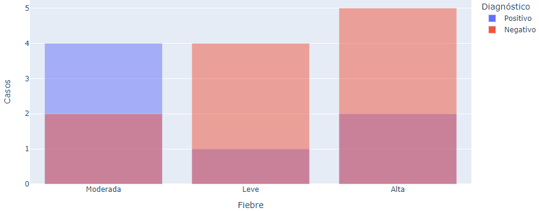
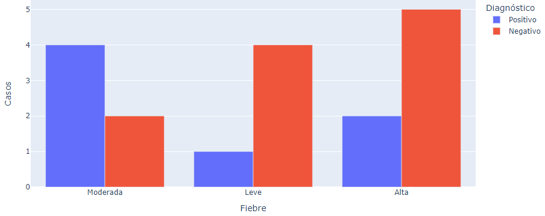

# Taller 3

### Tableros en Dash

##### Analítica Computacional para la Toma de Decisiones

---

|     Nombres      |      Apellidos       |     Login     |  Codigo   |
| :--------------: | :------------------: | :-----------: | :-------: |
|     Santiago     | Gonzalez Montealegre | s.gonzalez35  | 202012274 |
| Juliana Carolina |  Cardenas Barragan   | jc.cardenasb1 | 202011683 |

---

## 1.

¿Cómo se crea el objeto `app` en _Dash_?

   <br>

**R/**

Importamos la librería _Dash_ y posteriormente creamos un nuevo objeto de tipo Dash que pertenece a dicha librería. Dentro de los parámetros necesarios se encuentra `name=__name__` que es el valor que hace fácil para Dash encontrar ciertos elementos estáticos necesarios [1](https://www.angela1c.com/projects/dash/plotly_intro/)

```py
import dash

app = dash.Dash(name=__name__)

# Agregar parametros como hojas de estilo
app = dash.Dash(name=__name__, external_stylesheets=['url'])
```

---

## 2.

Describa el conjunto de datos del Dataframe

<br>

**R/**

```py
df = pd.DataFrame({
    "Fiebre": ["Moderada", "Leve", "Alta", "Moderada", "Leve", "Alta"],
    "Casos": [4, 1, 2, 2, 4, 5],
    "Diagnóstico": ["Positivo", "Positivo", "Positivo", "Negativo", "Negativo", "Negativo"]
})
```

|  Fiebre  | Casos | Diagnóstico |
| :------: | :---: | :---------: |
| Moderada |   4   |  Positivo   |
|   Leve   |   1   |  Positivo   |
|   Alta   |   2   |  Positivo   |
| Moderada |   2   |  Negativo   |
|   Leve   |   4   |  Negativo   |
|   Alta   |   5   |  Negativo   |

Los datos corresponden a un registro con tres columnas, Fiebre, Casos y Diagnóstico. Corresponde a una hoja de diagnóstico donde dependiendo si un paciente tiene fiebre y los casos que hay, se le da al paciente un diagnóstico Positivo o Negativo frente a cierta enfermedad.

---

## 3.

Ejecute la aplicación e incluya un pantallazo del código en ejecución y la aplicación siendo ejecutada en el navegador

<br>

**R/**


---

## 4.

Considerando la aplicación describa qué hace el comando

```py
fig = px.bar(data_frame=df, x="Fiebre", y="Casos", color="Diagnóstico", barmode="group")
```

<br>

**R/**

Se crea en una variable un objeto que posteriormente será agregado a la aplicación. Este objeto es creado con la librería `plotly.express` y es un objeto para crear un gráfico de barras.

**Parámetros**

- `data_frame`: Recibe valores de tipo pandas DataFrame donde están registrados los datos que se van a graficar.
- `x`: El nombre de la columna del DataFrame recibido en `data_frame` cuyos valores serán usados para colocar marcas a lo largo del eje x del gráfico.
- `y`: El nombre de la columna del DataFrame recibido en `data_frame` cuyos valores serán usados para colocar marcas a lo largo del eje y del gráfico.
- `color`: El nombre de la columna del DataFrame recibido en `data_frame` cuyos valores serán usados para asignar colores a las marcas. Generalmente se usa para variables categóricas que distingan los datos.
- `barmode`: Un `str` que puede recibir los valores `'relative'`, `'overlay'`, `'group'`.
  - `'relative'`: las barras para las categorías son apiladas o _stacked_ una encima de la otra.  
    
  - `'overlay'`: las barras son dibujadas una encima de la otra, se solapan.
    
  - `'group'`: las barras son dibujadas al lado de la otra para distinguir las categorías.
    

---

## 5.

Describa que hace el siguiente código

```py
dcc.Graph(
   id='example-graph',
   figure=fig
),
```

Esto permite añadir a la aplicación la gráfica que creamos anteriormente.

- `id`: este parámetro permite identificar de forma particular este elemento, en caso de que sea necesario añadirle estilo personalizado o ser referenciado por otro objeto del HTML.
- `figure`: es en este parámetro donde se le agrega la variable en la cual creamos la figura a mostrar.
